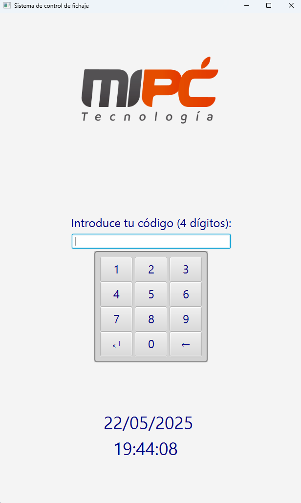
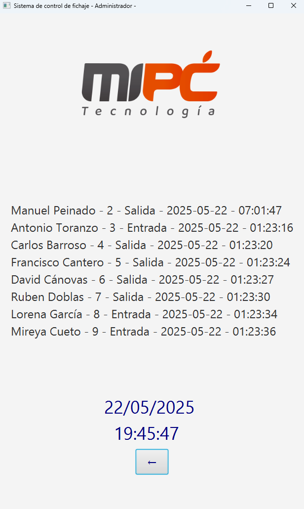

# 🕒 Sistema de Control de Fichaje - JavaFX

Este es un sistema de fichaje de empleados desarrollado en **Java con JavaFX**, que permite:

- Fichaje de entrada y salida con PIN.
- Visualización del estado de los empleados.
- Acceso especial para administradores.
- Reloj en tiempo real y teclado numérico integrado.
- Interfaz gráfica intuitiva.

---


## 📩 Instalación de la aplicación

La aplicación está comprimida en el archivo llamado "controlDeFichajes.zip", para instalarla lo unico que tienes que hacer es: descargarlo y extraerlo el la carpeta que tu quieras.
1. Descargar el archivo "controlDeFichajes.zip".
2. Descomprimirlo donde quieras.
3. Leer el apartado "🚀 ¿Cómo ejecutar la aplicación?".

## 📦 Contenido del paquete

El proyecto incluye los siguientes archivos para su ejecución:

📁 controlDeFichajes/ # Carpeta madre del proyecto.
├── 📁 img/ # Carpeta donde se guardan las imágenes necesarias para la aplicación.
|    └── Logo_MiPc_Computadores # Imagen usada para el logo del Launcher y en la propia aplicación.
├── 📁 openjfx-24.0.1_windows-x64_bin-sdk/ # Carpeta donde se encuentran los archivos necesarios para que se pueda ejecutar la aplicación en javafx.
|    └── ...
├── Control_de_fichaje # Script para lanzar la aplicación.
├── javafx.jar # Archivo ejecutable del programa.
├── Launcher.bat # Ejecutable diseñado para que sea posible ejecutar la aplicación desde cualquier carpeta en el ordenador.
└── README.txt # Instrucciones de uso de la aplicación.

## 🖥️ Requisitos

- **Java 17 o superior** instalado en tu sistema  
  (puedes verificar con `java -version` en la terminal o CMD).
- **Acceso a internet** si usas imágenes desde URL (opcional).
- **Conexión a una base de datos MySQL** (ver sección de configuración).

---

## 🚀 ¿Cómo ejecutar la aplicación?

1. Asegúrate de tener Java instalado.
2. Inicia la base de datos (no es obligatorio, pero sin esta parte del programa no funcionará).
3. Haz doble clic en el archivo llamado `Launcher`.

> 💡 Esto abrirá automáticamente el sistema de fichaje con su interfaz gráfica.

---

## ⚙️ Configuración de base de datos (MySQL)

Debes tener una base de datos MySQL en ejecución. Ejecuta estas instrucciones en tu servidor MySQL:

```sql
CREATE DATABASE empleados;
USE empleados;

CREATE TABLE trabajador (
  codTrabajador INT PRIMARY KEY AUTO_INCREMENT,
  nombreTrabajador VARCHAR(100),
  pin CHAR(4),
  trabajando BOOLEAN,
  fechaFichaje DATETIME,
  esAdmin BOOLEAN
);

-- Datos de ejemplo:
INSERT INTO trabajador (nombreTrabajador, pin, trabajando, esAdmin)
VALUES ('Paco Lopez', '1234', false, NOW(), true),
       ('Manuel Peinado', '1111', false, NOW(), false);
       ('Antonio Toranzo', '2222', false, NOW(), false);
       ('Carlos Barroso', '3333', true, NOW(), false);
       ('Francisco Cantero', '4444', true, NOW(), false);
       ('David Cánovas', '5555', false, NOW(), false);
       ('Ruben Doblas', '6666', false, NOW(), false);
       ('Lorena García', '7777', true, NOW(), false);
       ('Mireya Cueto', '8888', true, NOW(), false);
```
🛠️ ¿Problemas comunes?
❌ El programa no se abre: Asegúrate de tener Java instalado y actualizado.

❌ No conecta a la base de datos: Verifica si está MySQL y PHPmyAdmin iniciados.
   Si no funciona, verifica la URL, usuario y contraseña en DAOUsuarioSQL.java.
   Si eso tampoco es el problema, prueba a iniciar sesión en PHPmyAdmin antes de iniciar el programa e inicialo con PHPmyAdmin abierto.
   
❌ Pantalla en blanco o sin imagen: Asegúrate de estar conectado a internet.


✅ Imagenes de la aplicación





👨‍💻 Autor
Desarrollado por Francisco Cantero Maestro
Proyecto de gestión de fichajes con JavaFX - 2025
